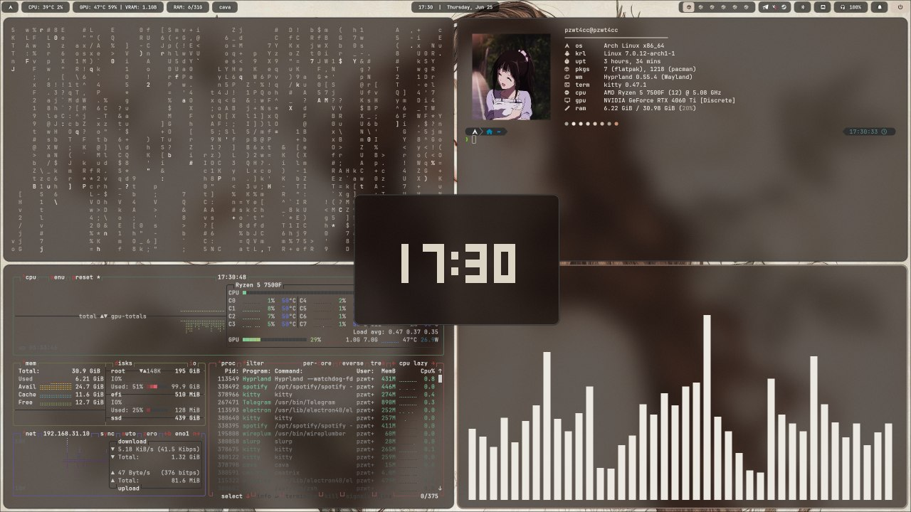
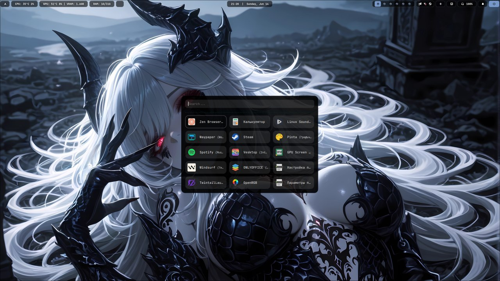
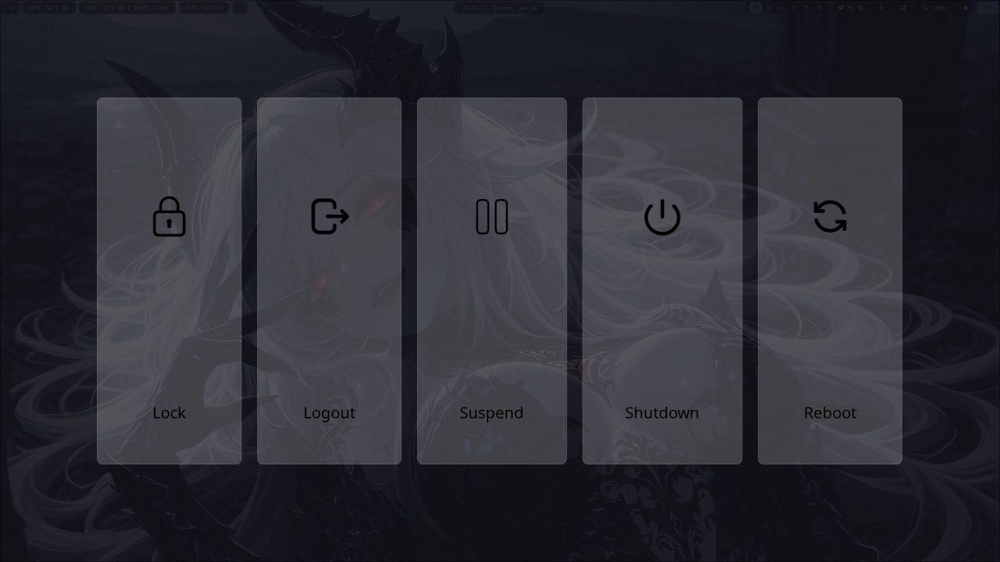
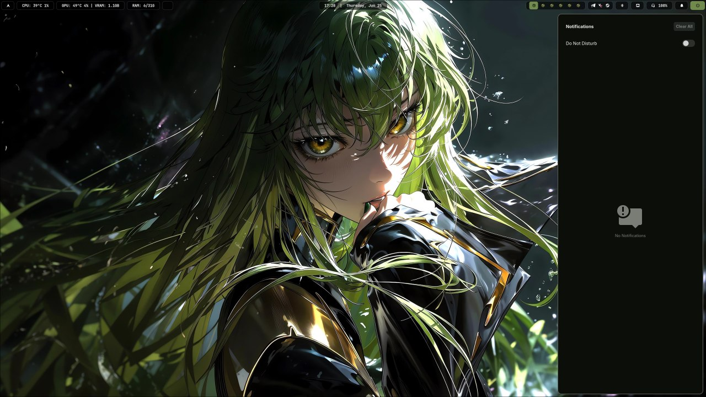
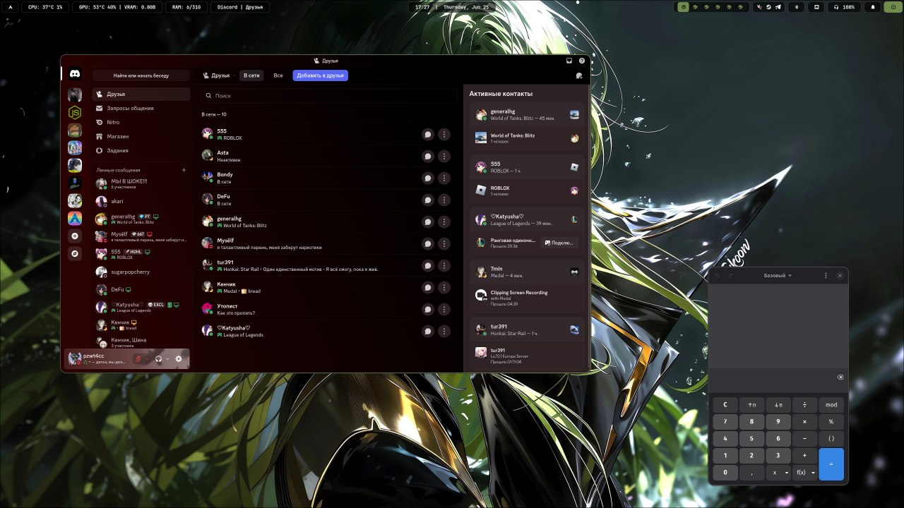
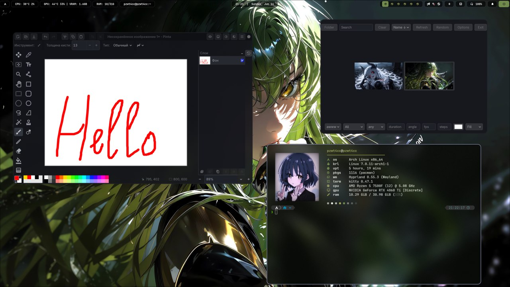
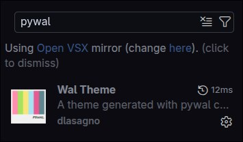

# Simple Hyprland Configuration for Arch

## Preview

https://github.com/user-attachments/assets/4ac1c3bf-4014-40af-83aa-567e6dbbf779

<br>

<p align="center">
  
  
</p>

<p align="center">
  
  
</p>

<p align="center">
  
  
</p>

## Note
Use **SUPER + `** to switch the special workspace

Use **SUPER + SHIFT + `** to move window to a special workspace

## Quick Setup
To get started, install the required packages. You can run this command:

**Arch Linux**:
```bash
sudo pacman -S --needed hyprland waybar swaync rofi-wayland kitty nautilus file-roller gst-libav wl-clipboard ffmpegthumbnailer blueman pavucontrol network-manager-applet grim slurp swappy nwg-look btop fastfetch mpv loupe gnome-calculator mousepad keepassxc qbittorrent flatpak ttf-jetbrains-mono-nerd papirus-icon-theme git base-devel hyprlock python-pywal cava cmatrix kdenlive yazi duf udiskie
```
```bash
yay -S --needed bibata-cursor-theme peaclock matugen-bin waypaper wlogout openrgb-git gpu-screen-recorder-ui
```

## How to Install

### 1. Clone the repository
```bash
git clone [https://github.com/pzwt4cc/dotfiles.git](https://github.com/pzwt4cc/dotfiles.git)
cd dotfiles
```

### 2. Back up .config folders if they exist
```bash
mkdir -p ~/.config_bak
[ -d ~/.config/hypr ] && mv ~/.config/hypr ~/.config_bak/
[ -d ~/.config/waybar ] && mv ~/.config/waybar ~/.config_bak/
[ -d ~/.config/swaync ] && mv ~/.config/swaync ~/.config_bak/
[ -d ~/.config/rofi ] && mv ~/.config/rofi ~/.config_bak/
[ -d ~/.config/kitty ] && mv ~/.config/kitty ~/.config_bak/
```

### 3. Back up old shell configs
```bash
[ -f ~/.zshrc ] && mv ~/.zshrc ~/.zshrc.bak
[ -f ~/.bashrc ] && mv ~/.bashrc ~/.bashrc.bak
```

### 4. Copy configuration files to your ~/.config/ folder
```bash
cp -r hypr waybar swaync rofi kitty cava fastfetch peaclock waypaper wlogout ~/.config/
```

## Initial Setup
After copying your configuration files, you need to generate the color scheme for the system:

```bash
# Generate colors from a wallpaper
wal -i ~/Pictures/Wallpapers/your-wallpaper.jpg
```

## Optional: Zsh Configuration

If you want an ultra-fast, modern Zsh setup featuring auto-suggestions, tab menus via `fzf`, and syntax highlighting, run this block **inside the cloned repository folder**:

```bash
# 1. Install Zsh core and tools
yay -S --needed zsh zsh-antidote fzf starship

# 2. Set Zsh as your default shell
chsh -s $(which zsh)

# 3. Copy configured shell files to your Home directory
cp ~/dotfiles/zsh/.zshrc ~/.zshrc
cp ~/dotfiles/zsh/.p10k.zsh ~/.p10k.zsh
cp ~/dotfiles/zsh/.zsh_plugins.txt ~/.zsh_plugins.txt

# 4. Apply changes and compile plugins
exec zsh
```

## Customization

- Wallpapers & Avatar: Update the paths in `~/.config/hypr/hyprlock.conf` to point to your image files.
  - background: `~/.config/hypr/assets/background.jpg`
  - avatar: `~/.config/hypr/assets/user.png`
  - (change images in `~/.config/hypr/assets/` folder)

- Monitors: The setup is universal (monitor=,preferred,auto,1).
- Edit `~/.config/hypr/conf/monitor.conf` if you need specific settings.
- Edit `~/.config/hypr/conf/windowrules.conf` to manage window rules.
- Edit `~/.config/hypr/conf/autostart.conf` to manage autostart programs.
- Edit `~/.config/hypr/conf/bind.conf` to manage binds.
- Use `waypaper` to change wallpapers.

## Accessing USB Drives
This setup uses `udiskie` for automatic mounting. For easy access to your USB drives directly from the root `/` directory, you can create a symbolic link:

```bash
# Create a permanent link in the root directory
sudo ln -s /run/media/$USER /usb
```

## Software Requirements

To ensure all window rules and configurations work as intended, the following applications are used in this setup:
Optionally, you can edit the file `~/.config/hypr/conf/windowrules.conf` to match your applications

### Utilities and Applications
* **Blueman**: Bluetooth manager.
  - `sudo pacman -S blueman`
* **Pavucontrol**: Audio volume control.
  - `sudo pacman -S pavucontrol`
* **NM Connection Editor**: Network management.
  - `sudo pacman -S network-manager-applet`
* **OpenRGB**: RGB lighting control.
  - `sudo pacman -S openrgb`
* **Gwenview / Loupe**: Image viewer.
  - `sudo pacman -S gwenview`
  - `sudo pacman -S loupe`
* **MPV**: Video player.
  - `sudo pacman -S mpv`
* **Mousepad**: Text editor.
  - `sudo pacman -S mousepad`
* **Calculator**: GNOME Calculator.
  - `sudo pacman -S gnome-calculator`

## Notes
To use colors in editors based on VS code, you need to install the extension:

