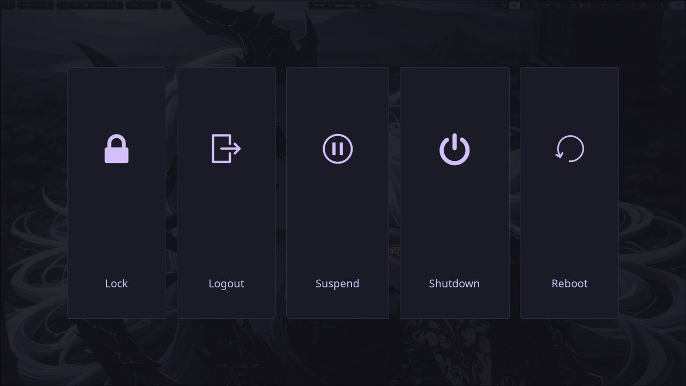

# Tokyo Night Hyprland

**Hyprland** setup using the **Tokyo Night** theme.

## Screenshots

| Desktop | Rofi Menu |
| :---: | :---: |
|  |  |

| Power Menu | Notification Center |
| :---: | :---: |
|  |  |

| Windows View 1 | Windows View 2 |
| :---: | :---: |
|  |  |

## Quick Setup
To get started, install the required packages. You can run this command:

(Some packages may need to be installed from AUR)

**Arch Linux**:
```bash
sudo pacman -S --needed hyprland waybar swaync rofi-wayland kitty nemo blueman pavucontrol wlogout network-manager-applet ttf-jetbrains-mono-nerd papirus-icon-theme grim slurp swww hyprlock
```

## How to Install

Back up your current config:

```bash
mv ~/.config/hypr ~/.config/hypr.bak
mv ~/.config/waybar ~/.config/waybar.bak
mv ~/.config/swaync ~/.config/swaync.bak
mv ~/.config/rofi ~/.config/rofi.bak
mv ~/.config/kitty ~/.config/kitty.bak
```

Copy these files to your ~/.config/ folder:

```bash
cp -r hypr waybar swaync rofi kitty ~/.config/
```

## Customization

- Monitors: The setup is universal (monitor=,preferred,auto,1).
  - Edit `~/.config/hypr/conf/monitor.conf` if you need specific settings.
- Wallpapers & Avatar: Update the paths in `~/.config/hypr/hyprlock.conf` to point to your image files.

## What's included

- Hyprland — Window Manager

- Waybar — Status Bar

- SwayNC — Notification Center

- Rofi — App Launcher

- Kitty — Terminal
